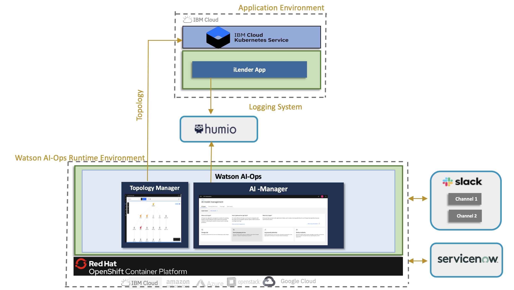

# Watson AIOps 3.2.0 Demo Setup with iLender Application

This article explains about Watson AIOps 3.2.0 demo setup with iLender Application.

The article is based on the the following
 - RedHat OpenShift 4.8 on IBM Cloud (ROKS)
 - Watson AIOps 3.2.0

### Architecture

Here is the architecture that is going to be setup.    

### 1. Pre-requisites on User Laptop  / client linux VM

<table>
    <tr>
        <td width="4%">S.No</td>
        <td width="28%">Title</td>
        <td width="40%">Description</td>
        <td width="20%">Reference</td>
    </tr>
    <tr>
        <td>1.1</td>
        <td>Install Apache Benche </td>
        <td>To create load on the app</td>
        <td>

[Details ...](https://httpd.apache.org/download.cgi)
        </td>
    </tr>
    <tr>
        <td>1.2</td>
        <td>Other installs </td>
        <td> Openshift CLI, Kubectl CLi, Curl, jq, Helm </td>
        <td>
        </td>
    </tr>        
</table>

### 2. Watson AIOps 3.2 Installation

<table>
    <tr>
        <td width="4%">S.No</td>
        <td width="84%">Title</td>
        <td width="12%">Reference</td>
    </tr>
    <tr>
        <td>2.1</td>
        <td>Watson AIOps 3.2.0 Installation and demo setup requirements</td>
        <td>

[Details ...](https://community.ibm.com/community/user/aiops/blogs/jeya-gandhi-rajan-m1/2021/12/27/waiops-v32-series-02-watson-aiops-ai-manager-insta)
        </td>
    </tr>
        <tr>
        <td>2.2</td>
        <td>Updating Global Pull Secrets before installing WAIOps 3.2</td>
        <td>
[Details ...](https://community.ibm.com/community/user/aiops/blogs/jeya-gandhi-rajan-m1/2021/12/27/waiops-v32-series-02-watson-aiops-ai-manager-insta)
        </td>
    </tr>
    <tr>
        <td>2.3</td>
        <td>Installing Watson AIOps AI-Manager on ROKS</td>
        <td>
[Details ...](https://community.ibm.com/community/user/aiops/blogs/jeya-gandhi-rajan-m1/2021/12/27/waiops-v32-series-02-watson-aiops-ai-manager-insta)
        </td>
    </tr>

</table>

### 3. Setup Managed Environment

<table>
    <tr>
        <td width="4%">S.No</td>
        <td width="28%">Title</td>
        <td width="40%">Description</td>
        <td width="20%">Reference</td>
    </tr>
    <tr>
        <td>3.1</td>
        <td>Install iLender app</td>
        <td>Install iLender app on the managed environment</td>
        <td>

[Details](https://community.ibm.com/community/user/aiops/blogs/jeya-gandhi-rajan-m1/2021/12/27/waiops-v32-series-03-installing-ilender-app)</td>
    </tr>
</table>

### 4. Setup Operational Systems
<table>
    <tr>
        <td width="4%">S.No</td>
        <td width="28%">Title</td>
        <td width="40%">Description</td>
        <td width="8%">Environment</td>
        <td width="20%">Reference</td>
    </tr>
    <tr>
        <td>4.1.a</td>
        <td>Install Humio on VM</td>
        <td>Setup Humio on a single node (16 core, 64 GB)</td>
        <td>Any VM</td>
        <td>

[Details ...](https://github.com/diimallya/humio-single-node)</td>
    </tr> 
        <tr>
        <td>4.1.b</td>
        <td>Install Humio on OpenShift</td>
        <td>Setup Humio on OpenShift</td>
        <td></td>
        <td>

[Details ...](https://community.ibm.com/community/user/aiops/blogs/jeya-gandhi-rajan-m1/2021/12/27/installing-humio-on-redhat-openshift)</td>
    </tr>     
    <tr>
        <td>4.2 </td>
        <td>Create Slack acccount</td>
        <td>Setup free slack account and create workspace, channels and slack app</td>
        <td>Slack</td>
        <td>[Details](https://community.ibm.com/community/user/aiops/blogs/jeya-gandhi-rajan-m1/2021/12/27/waiops-v32-series-05-slack-account-creation-and-in)</td>
    </tr>   
    <tr>
        <td>4.3 </td>
        <td>Create ServiceNow Instance</td>
        <td></td>
        <td>ServiceNow</td>
        <td>[Details ...](https://developer.servicenow.com/dev.do)</td>
    </tr>
    <tr>
        <td>4.4 </td>
        <td>Create Sample Incidents in Service now</td>
        <td></td>
        <td>ServiceNow</td>
        <td>[Details](https://github.com/ibm-gsi-ecosystem/watson-ai-ops-snow/tree/main/01-snow-incidents)</td>
    </tr>
</table>

### 5. Setup Initial Configurations
<table>
    <tr>
        <td width="4%">S.No</td>
        <td width="28%">Title</td>
        <td width="48%">Description</td>
        <td width="20%">Reference</td>
    </tr>
    <tr>
        <td>5.1</td>
        <td>Setup Slack Integration</td>
        <td>Integrate with Slack collaboration platform. Need to copy nginx certificate as well.</td>
        <td>

[Details](https://community.ibm.com/community/user/aiops/blogs/jeya-gandhi-rajan-m1/2021/12/27/waiops-v32-series-04-create-data-and-tool-integrat)
</td>
    </tr>
    <tr>
        <td>5.2</td>
        <td>Setup Humio Integration</td>
        <td>&nbsp;</td>
        <td> 
        
[Details](https://community.ibm.com/community/user/aiops/blogs/jeya-gandhi-rajan-m1/2021/12/27/waiops-v32-series-04-create-data-and-tool-integrat)</td>
    </tr>
    <tr>
        <td>5.3</td>
        <td>Setup Servicenow Integration</td>
        <td>&nbsp;</td>
        <td>
[Details](https://community.ibm.com/community/user/aiops/blogs/jeya-gandhi-rajan-m1/2021/12/27/waiops-v32-series-04-create-data-and-tool-integrat)
        </td>
    </tr>
    <tr>
        <td>5.4</td>
        <td>Setup Kubernetes Integration</td>
        <td>&nbsp;</td>
        <td>
[Details](https://community.ibm.com/community/user/aiops/blogs/jeya-gandhi-rajan-m1/2021/12/27/waiops-v32-series-04-create-data-and-tool-integrat)
        </td>
    </tr>    
</table>

### 6. Application Management

<table>
    <tr>
        <td width="4%">S.No</td>
        <td width="76%">Title</td>
        <td width="20%">Reference</td>
    </tr>
    <tr>
        <td>6.1</td>
        <td>Create Application from Resource Groups </td>
        <td>

[Details](https://community.ibm.com/community/user/aiops/blogs/jeya-gandhi-rajan-m1/2021/12/27/waiops-v32-series-06-create-application-in-ai-mana)</td>
    </tr>
</table>

### 7. AI Model Management

<table>
    <tr>
        <td width="4%">S.No</td>
        <td width="76%">Title</td>
        <td width="20%">Reference</td>
    </tr>
    <tr>
        <td>7.1</td>
        <td>Create Training Definition for Log Anomaly Detection </td>
        <td>

[Details](https://community.ibm.com/community/user/aiops/blogs/jeya-gandhi-rajan-m1/2021/12/27/waiops-v32-series-07-create-ai-model-definition)  
        </td>
    </tr>
    <tr>
        <td>7.2</td>
        <td>Create Training Definition for Similar Incidents </td>
        <td>

[Details](https://community.ibm.com/community/user/aiops/blogs/jeya-gandhi-rajan-m1/2021/12/27/waiops-v32-series-07-create-ai-model-definition)  
        </td>
    </tr>    
</table>

### 8. Training

<table>
    <tr>
        <td width="4%">S.No</td>
        <td width="28%">Title</td>
        <td width="48%">Description</td>
        <td width="20%">Reference</td>
    </tr>
    <tr>
        <td>8.1</td>
        <td>Generate Load</td>
        <td>Generate the load for the app.</td>
        <td>

[Details](https://community.ibm.com/community/user/aiops/blogs/jeya-gandhi-rajan-m1/2021/12/27/waiops-v32-series-08-training)
        </td>
    </tr>    
    <tr>
        <td>8.2</td>
        <td>Log Anomaly Detection training </td>
        <td>Create load in app, enable Data flow on humio integration, selction the mode, start the Log Anomaly Detection training</td>
        <td>[Details](https://community.ibm.com/community/user/aiops/blogs/jeya-gandhi-rajan-m1/2021/12/27/waiops-v32-series-08-training)</td>
    </tr>
    <tr>
        <td>8.4</td>
        <td>Similar Incidents training </td>
        <td>Enable Data flow on Servicenow integration, selction the mode, start the Similar Incidents training</td>
        <td>[Details](https://community.ibm.com/community/user/aiops/blogs/jeya-gandhi-rajan-m1/2021/12/27/waiops-v32-series-08-training)</td>
    </tr>    
</table>

### 9. Inferencing

<table>
    <tr>
        <td width="4%">S.No</td>
        <td width="28%">Title</td>
        <td width="48%">Description</td>
        <td width="20%">Reference</td>
    </tr>
    <tr>
        <td>9.1</td>
        <td>Demo Script </td>
        <td>Prepare demo script to introduce log anomaly and ingest events</td>
        <td>

[Details](https://community.ibm.com/community/user/aiops/blogs/jeya-gandhi-rajan-m1/2021/12/27/waiops-v32-series-09-inferencing)
        </td>
    </tr>
    <tr>
        <td>9.2</td>
        <td>Run Demo </td>
        <td>Run the demo script to induce error in credtiscore service based on the load</td>
        <td>

[Details](https://community.ibm.com/community/user/aiops/blogs/jeya-gandhi-rajan-m1/2021/12/27/waiops-v32-series-09-inferencing)
        </td>
    </tr>
    <tr>
        <td>9.3</td>
        <td>Check Stories on Web and Slack  </td>
        <td>Check the stories created by WA</td>
        <td>

[Details](https://community.ibm.com/community/user/aiops/blogs/jeya-gandhi-rajan-m1/2021/12/27/waiops-v32-series-09-inferencing)
        </td>
    </tr>
</table>
