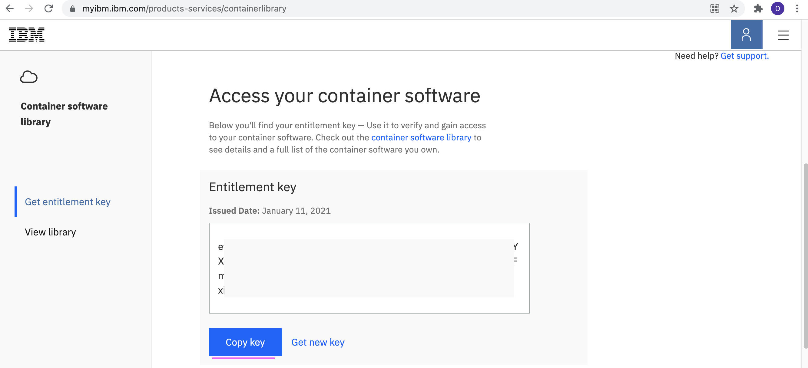
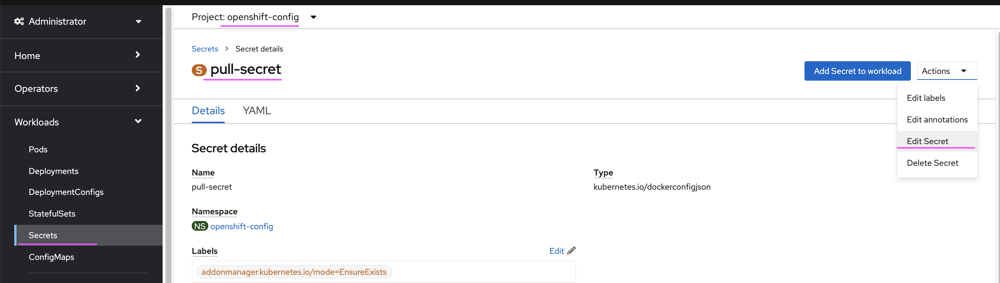
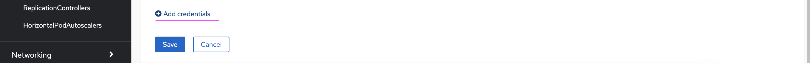
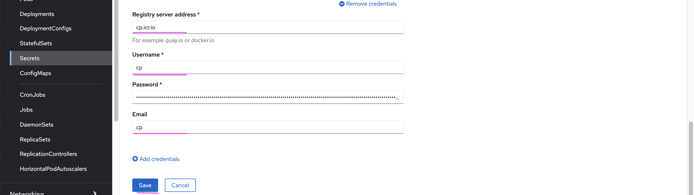
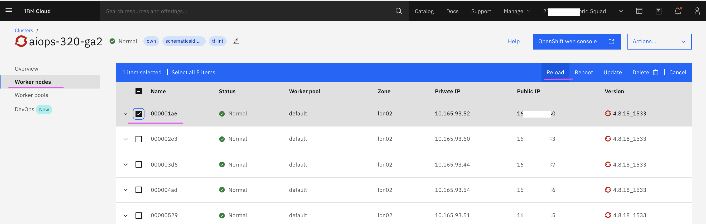

# Watson AIOps AI-Manager Installation

This article explains about how to install Watson AIOps AI-Manager on ROKS. The below sections describes that.

- Watson AIOps 3.2.0 installation and demo setup requirements.
- Updating Global Pull Secrets before installing WAIOps 3.2
- Installing Watson AIOps AI-Manager on ROKS

The article is based on the the following.

- RedHat OpenShift 4.8 on IBM Cloud (ROKS)
- Watson AIOps 3.2.0

## 1. Watson AIOps 3.2.0 installation and demo setup requirements.

This documentation explains about the Hardware and account requirements for Watson AIOps 3.2.0 installation and demo setup.

### 1. RedHat Openshift on IBM Cloud

A RedHat Openshift on IBM Cloud (ROKS) with the below configuration needed to install Watson AIOps 3.2

 - OCP Version : 4.8.18
 - 5 Nodes with b3c.16x64 flavour. (CPU 16 core, Memory 64 GB)
 - Classic Infrastructure

### 2. IKS Cluster on IBM Cloud

A IBM Cloud Kubernetes Service, cluster on IBM cloud is needed to install iLender application (a sample application). This is required for WAIOps demo setup.

 - Kubernetes Version : 1.19.15_1565
 - 1 Node with b3c.8x32 flavour. (CPU 8 core, Memory 32 GB)
 - Classic Infrastructure

### 3. Humio VM

A VM with the below configuration is needed for Humio Logging System installation as part of the WAIOps demo setup.

 - OS : CentOS Linux 8
 - CPU : 16 Core
 - Memory : 64 GB

### 4. Slack Account

SRE would be indicated about the incident through ChatOps such as Slack or Team. 

Slack account is required for the WAIOps demo setup.

The link [here](https://community.ibm.com/community/user/aiops/blogs/jeya-gandhi-rajan-m1/2021/12/27/waiops-v32-series-05-slack-account-creation-and-in
) explains about account creation and integration with WAIOps.

### 5. ServiceNow Account

A ServiceNow account is required or atleast Developer instance to be created using the below URL as part of the WAIOps demo setup..

https://developer.servicenow.com/dev.do#!/guides/paris/developer-program/pdi-guide/obtaining-a-pdi

Watson AIOps can create Incidents in ServiceNow apart from slack story. Also it can train the existing incidents from ServiceNow for identifying the Similar Incidents and to choose the next best action, in case of an incident.

## 2. Updating Global Pull Secrets before installing WAIOps 3.2

This documentation explains about how to update Global Pull Secret in Openshift before installing WAIOps 3.2

### Get the IBM entitlement key

1. Goto https://myibm.ibm.com/products-services/containerlibrary

2. Copy the key in notepad



### Edit Secret

3. Select the secret called `pull-secret` under the namespace `openshift-config`

4. Choose `Edit Secret`



5. Click on `Add credentials` menu




### Enter credentials

6. Enter the below values.

- cp.icr.io
- cp
- entitlement key copied in notepad
- cp

7. Click on `save` button.



Global pull secrets got updated with ibm entitlement key.

### Reload the worker nodes

Worker nodes to be be reloaded for the pull secrets to reflect.

8. Goto http://cloud.ibm.com

9. Choose your OCP cluster

10. Click on `Worker Nodes`

11. Choose 1 node at a time (checkbox)

12. Click on `Reload` menu and wait until it get reloaded and the status become `Normal`. Reload process may take 5 to 10 minutes per node.

13. Repeat the steps from 11 for each node.




## 3. Installing Watson AIOps AI-Manager on ROKS

This document explains about Installing Watson AIOps AI-Manager on ROKS.

This document is based on the IBM Documentation https://www.ibm.com/docs/en/cloud-paks/cloud-pak-watson-aiops/3.2.0?topic=manager-starter-installation

### Pre-requisite

Global Pull Secret to be updated in Openshift before installing WAIOps 3.2.0. This is discussed in the above section.

### 1. Create Project, entitlement key secret and catalog source  

In this section we create the following.

- Create a custom project called `cp4waiops`
- Create an Operator group called `cp4waiops-operator-group` in your custom project `cp4waiops`
- Create the entitlement key pull secret called `ibm-entitlement-key`
- Create the catalog source called `ibm-operator-catalog`

Do the following.

1. Get `IBM entitlement key` from https://myibm.ibm.com/products-services/containerlibrary
2. Replace the value of the `ENTITLEMENT_KEY` variable in `files/01-project-secret-catalog-source.sh`
3. Run the command `sh files/01-project-secret-catalog-source.sh`

### 2. Install  AI-Manager operator

In this section, we install the AI-Manager operator by creating the `subscription` called `ibm-aiops-orchestrator` .

Do the following.

1. Run the command `sh files/02-ai-manager-operator.sh`

### 3. Verify  AI-Manager operator install completed

In this section, we verify the AI-Manager operator install is completed or not.

Do the following.

1. Run the command `sh files/03-verify-ai-manager-operator.sh`
2. It should print the output like this.
```
ibm-aiops-orchestrator-6c7cfc85b7-j9c92                           1/1     Running   0          6m27s
```
3. Repeat the command in step 1 until it is showing `Running` state.

### 4. Install AI-Manager

In this section, we install the AI-Manager by creating the `Installation` called `ibm-cp-watson-aiops` .

Do the following.

1. Run the command `sh files/04-ai-manager.sh`

Note that we use `ibmc-file-gold-gid` storage class here.

```
  storageClass: ibmc-file-gold-gid
  storageClassLargeBlock: ibmc-file-gold-gid
```

### 5. Verify AI-Manager install completed

In this section, we verify the AI-Manager install is completed or not.

Do the following.

1. Run the command `sh files/05-verify-ai-manager.sh`
2. It should print the output like this.
```
NAME                  PHASE     LICENSE    STORAGECLASS         STORAGECLASSLARGEBLOCK   AGE
ibm-cp-watson-aiops   Running   Accepted   ibmc-file-gold-gid   ibmc-file-gold-gid       8m1s
```
3. Repeat the command in step 1 until it is showing `Running` state.

4. Wait for 30 minutes to 1 hour time to get the install completed. After 1hr, make sure that no pods are in error state.

### 6. Print the AIOps Console URL details

In this section, we print the AIOps Console URL, user and password info.

Do the following.

1. Run the command `sh files/06-print-aiops-console-url-pwd.sh`
2. It should print the output like this.
```
====================================================================================
URL : https://cpd-cp4waiops.abcd-efg.containers.appdomain.cloud
USER: admin
PASSWORD: 
====================================================================================
```
3. You can use this to login into the WAIOps Console.


### 7. Update NGINX Certificate

In this section, update the nginx certificate.

Do the following.

1. Run the command `sh files/07-update-nginx-certificate.sh`

2. Wait for 3 or 4 minutes for the nginx pod to be up.
