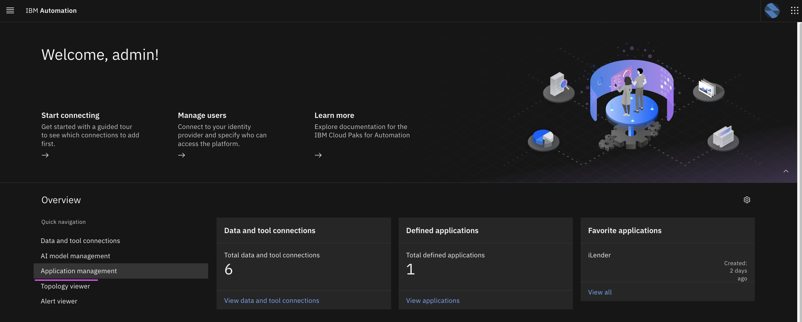
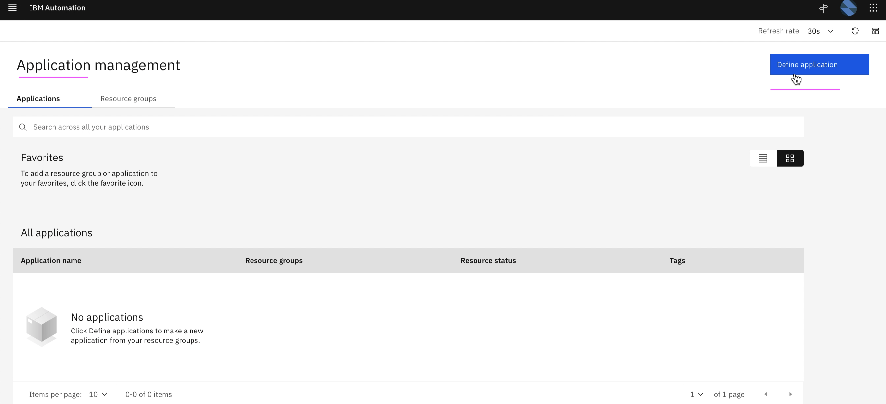
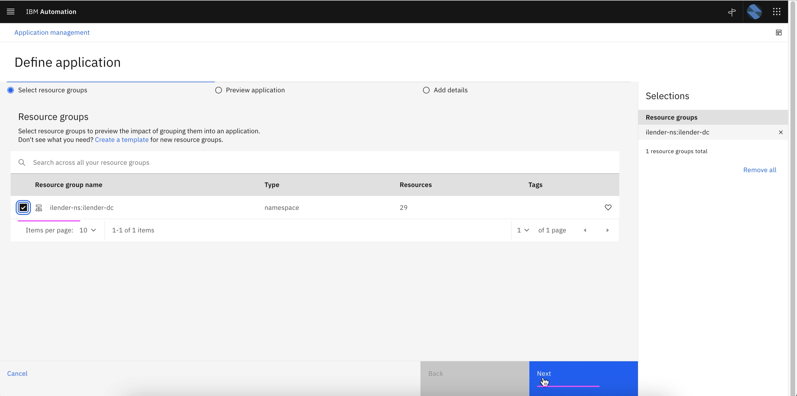
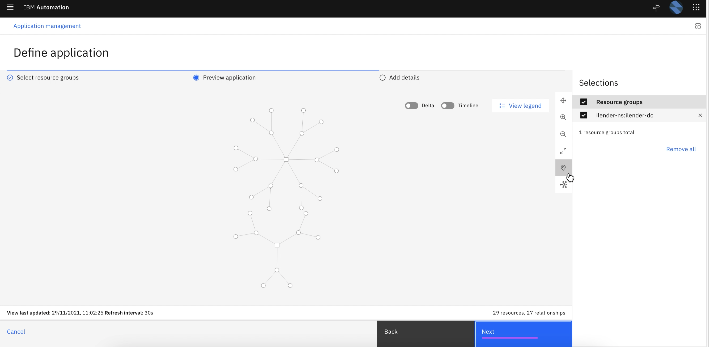
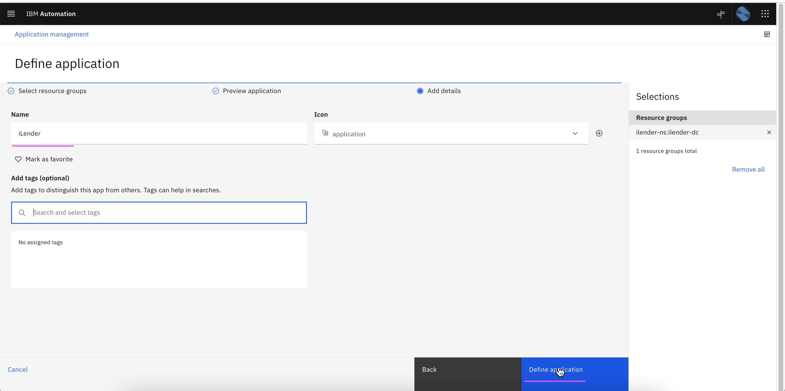
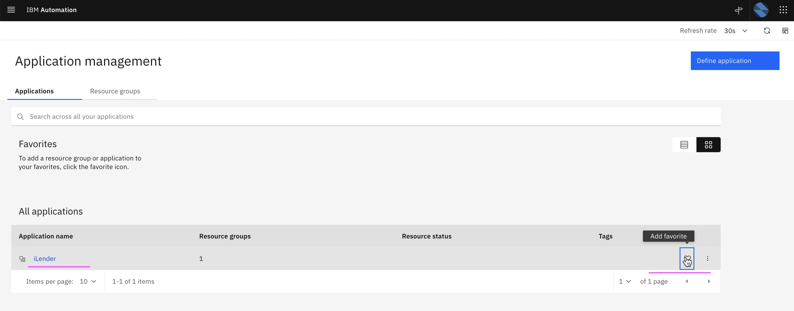
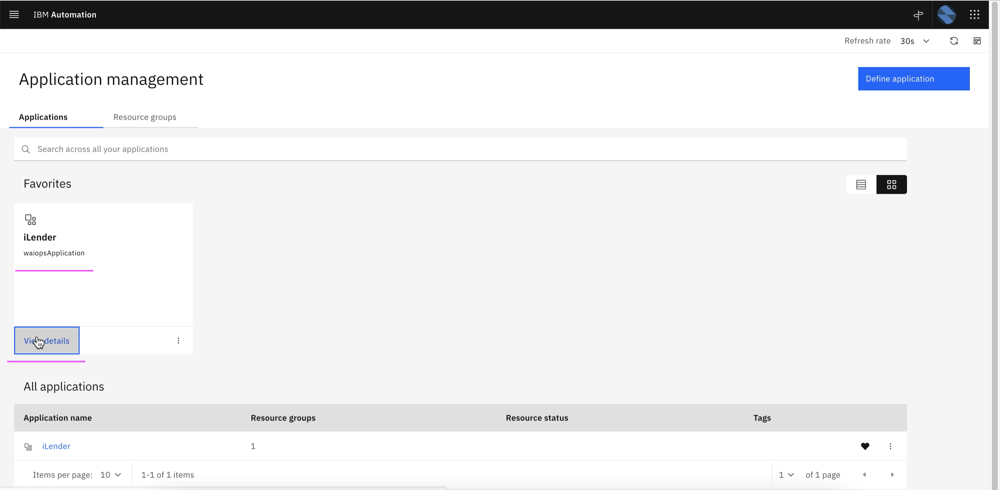
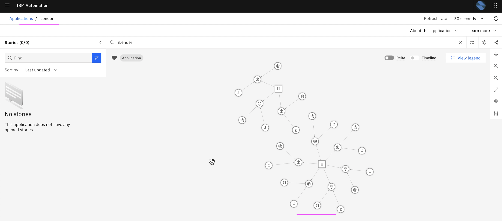

# Create Application in AI-Manager

This article explains about how to Create Application using Kubernetes Observer in Watson AIOps.

The article is based on the the following.

- RedHat OpenShift 4.8 on IBM Cloud (ROKS)
- Watson AIOps 3.2.0

## Pre-Requisite

Kubernetes observer is one of the Integrations that should have been created in WAIOps. This observer would observe all the Kubernetes resources, such as pod, service, deployment, node and etc, available in the given namespace. 

To know how to create kubernetes observer, you can refer the link https://community.ibm.com/community/user/aiops/blogs/jeya-gandhi-rajan-m1/2021/05/12/aiops-v31-series-01-data-and-tool-integrations

## Steps

1. Click on `Application Management` to goto the application management screen.

2. Click on `Define Application`

Resource groups screen shows list of groups which are observered through Kubernetes observer.

The Kubernetes observer should have observed the namespace `ilender-ns` and the group `ilender-ns: ilender-dc` should have been created.

3. Choose `ilender-ns: ilender-dc`.

4. Click on `Next`

This shows list of resource groups selected for this application. 

5. Click on `Next`

6. Enter any name to the application and choose application icon.

7. Click on `Define Application`

8. Application is created.

Click on `Add to Favourite` link to show this application as a tile in the favorite section.

9. Click on `View Details` to see the app details.

10. Topology is displayed. This will have all the Kubernetes resources, such as pod, service, deployment, node and etc, available in the given namespace. 

