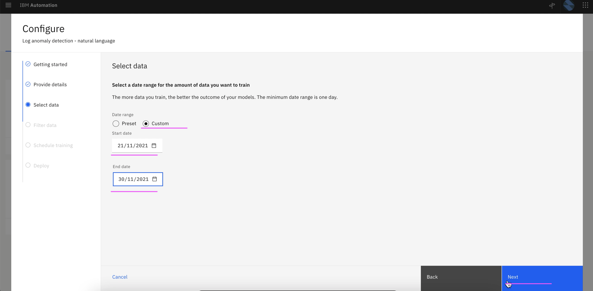

# Create AI-Model Definition

This article explains about how create to AI-Model Definition for the following in Watson AIOps.

- Log Anomaly detection
- Similar Incidents

The article is based on the the following

- RedHat OpenShift 4.8 on IBM Cloud (ROKS)
- Watson AIOps 3.2.0

## 1. Create AI-Model Definition for log anomaly

1. Click on `AI Model Management` link

2. Click on `Configure` link in `Log anomaly detection - natural language` card

3. Click on `Next` 

4. Enter the below field values

- Configuration Name 
- Configuration Description 

5. Click on `Next` 

4. Enter the below field values

- Custom : On
- Start Date: Yesterday date
- End Date: Tomorrow date

(While training, we will go for live logs and the date of the live logs should fall under this date range)

5. Click on `Next` 

5. Click on `Next` 

5. Click on `Next` 

4. Enter the below field values

- Deployment Type : On Completion

5. Click on `Done` 

5. See the status as `Configured` 

9. Click on `Manage` tab.

The Log Anomaly model training definition is displayed.

## 2. Create AI-Model Definition for Similar Incidents

1. Goto the page `AI Model Management`

2. Click on `Configure` link in `Similar Incidents` card

3. Click on `Next`

4. Enter the below field values

- Configuration Name 
- Configuration Description 

5. Click on `Next` 

6. Click on `Next` 

7. Click on `Done` 

8. Similar incidents training definition is created

9. Click on `Manage` tab.

The Similar incidents  training definition is displayed.

