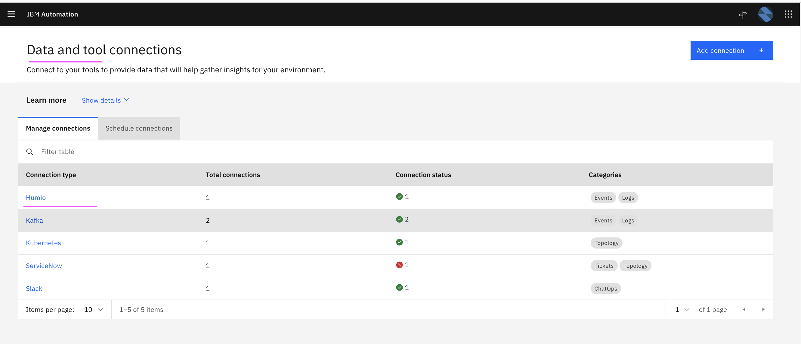
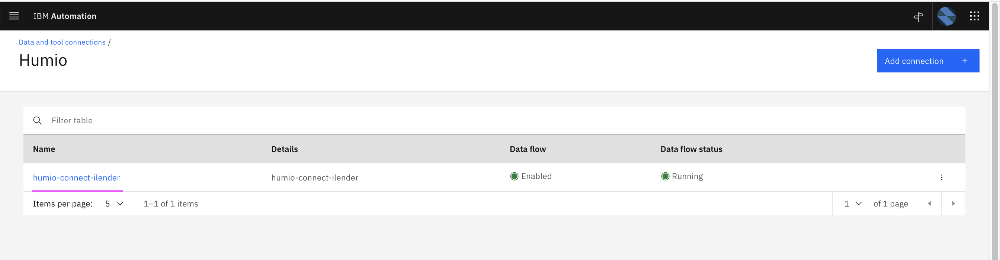
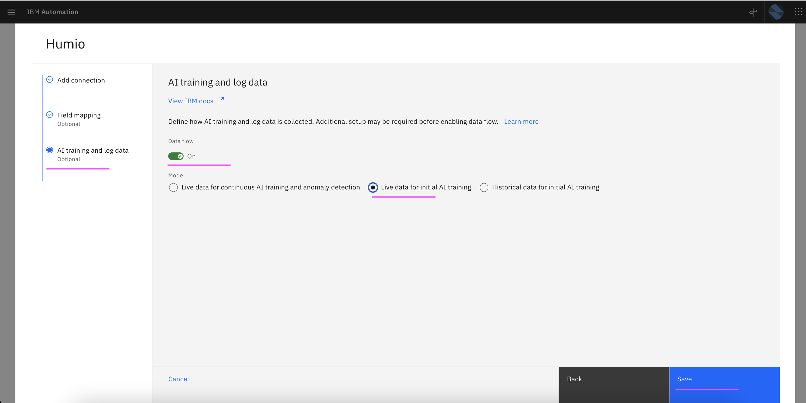
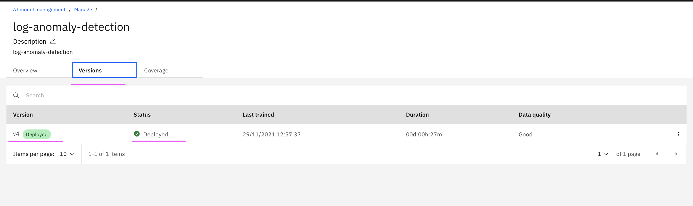
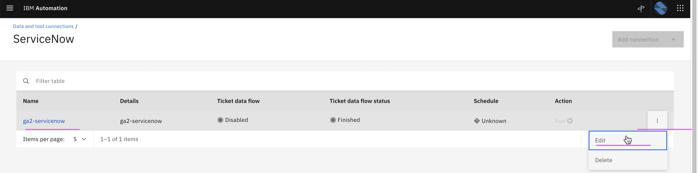
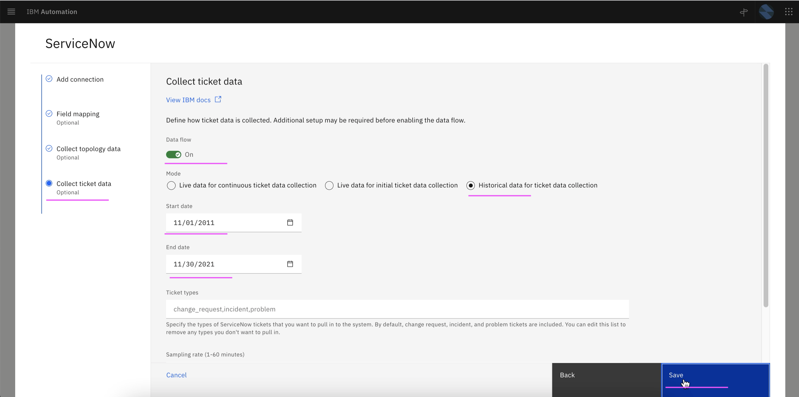
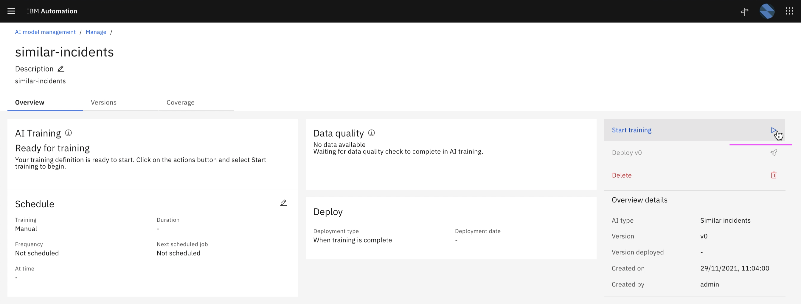

# Training

This article explains about how to do Training for the following in Watson AIOps.

- Log Anomaly detection
- Similar Incidents

The article is based on the the following

- RedHat OpenShift 4.8 on IBM Cloud (ROKS)
- Watson AIOps 3.2.0

## 1. Training - Log Amomaly Detection

### 1. Application

We use iLender application here. 

Refer : [1. Deploying iLender Application](https://community.ibm.com/community/user/aiops/blogs/jeya-gandhi-rajan-m1/2021/12/27/waiops-v32-series-03-installing-ilender-app
) to know how the app is deployed.

### 2. Generate Load

Generate load in the application for 20 minutes by refering [2. Generate Load for iLender App](https://community.ibm.com/community/user/aiops/blogs/jeya-gandhi-rajan-m1/2021/12/27/waiops-v32-series-03-installing-ilender-app).

You need to have 10K lines of logs for each service in the application.

### 3. Enable Live logs for Training

While the load is ongoing in the application, do the following steps to enable the live log mode and to copy the logs into AIMgr for training. 

1. Goto the page `Data and tool connections` and select `Humio` 

2. Click on the humio connection `humio-connect-ilender`

3. Select the `Data flow` : `On`

4. Select the `Mode` : `Live Data for Initial AI Training`

5. Click on the `Save`

Now the live data would get copied to AIMgr.

### 4. Stop Live logs

After 25 minutes, live logs can be disbled.

1. Select the `Data flow` : `Off`

2. Click on the `Save`

### 5. Stop Load

The load script would have been stopped after 20 minutes.

### 6. Do Training

1. Goto the page `AI Model Management`

2. Click on `Manage` tab

3. Click on `log-anomaly-detection` link

4. Click on `Start Training` link

The training would start and go for `20 minutes` to `1 hour` based on the data size.

You will have `Training Complete` status once the training is done.

5. Click on `Versions` tab

You can see the version trained and deployed.

## 2. Training - Similar Incidents

1. Goto the page `AI Model Management`

2. Click on `Configure` link in `Similar Incidents` card

3. Click on `Next`

4. Enter the below field values

- Configuration Name 
- Configuration Description 

5. Click on `Next` 

6. Click on `Next` 

7. Click on `Done` 

8. Similar incidents training definition is created

9. Click on `Manage` tab.

The Similar incidents  training definition is displayed.

