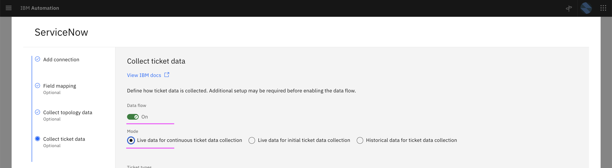

# Inferencing

This article explains about how to do Inferencing of Log Amomaly Detection and Similar incidents in Watson AIOps.

The article is based on the the following

- RedHat OpenShift 4.8 on IBM Cloud (ROKS)
- Watson AIOps 3.2.0

## 1. Demo Script

This section explain about the demo script. Need to update few properties in the `config.sh`.

The demo script is avialable [here](./files). 


#### 1. Update API_URL Property

Update the API_URL property with application url.

```
API_URL=http://1.1.1.1:30600
```

Refer : [1. Deploying iLender Application](https://community.ibm.com/community/user/aiops/blogs/jeya-gandhi-rajan-m1/2021/12/27/waiops-v32-series-03-installing-ilender-app
) to know how the app is deployed.

#### 2. Update API_URL_CREDIT_SCORE Url

Update the API_URL_CREDIT_SCORE property with creditscore service url.

```
API_URL_CREDIT_SCORE=http://1.1.1.1:30601
```

Refer : [1. Deploying iLender Application](https://community.ibm.com/community/user/aiops/blogs/jeya-gandhi-rajan-m1/2021/12/27/waiops-v32-series-03-installing-ilender-app
) to get creditscore url.

## 2. Run Demo (Inferencing)

This section explains about how to run the Inferencing demo in Watson AIOps.

## 1. Enable Data flow in Humio Integration

1. Choose the `Humio` integration from the `Data and Tool integrations` page.


2. Enable the `Data flow` on.

3. Select the option `Live data for Continious AI training and anomaly detection`.

4. Save it.

## 2. Enable Data flow in ServiceNow Integration

1. Choose the `ServiceNow` integration from the `Data and Tool integrations` page.



2. Enable the `Data flow` on.

3. Select the option `Live data for Continious ticket data collection`.

4. Save it.

## 3. Run Demo Script

The demo script is avialable [here](./files). 

Run `sh 01-demo.sh` to start the demo.

You will see the menu options like this.


2. 1. Enter `1` to choose the menu option `1  -  Create Loan in iLender App`

The output would be like the below. This will run for 4 minutes.


This demo option will introduce `out of memory error` in the creditscore service based on the increasing load. 

3. As a result, the log anomaly is created and story will be created in the slack.  

## Next Step

By sucessful execution of the above demo step, the story would have been created and you can see them in the next section.


## 3. Viewing Inferencing Results

This section explains about what and where to view Inferencing results.

### 1. Alert Viewer

1. Alert Viewer shows all the alerts created for this probelm.


### 2. Slack Story

Slack story shows the incident details to SRE.

1. Slack story for this probelm


2. Click on `Show More` to see the details.


3. Click on `View Alert Details` to see the alert details.


4. Click on `View Alerts` to see the alerts.


### 3. Application Management

In application management also the story is shown.

1. Application tiles showing the alerts


2. Click on `View Details` to see the details.

You can see the story and topology.


3. Click on `Hand icon` to see the alerts.


4. Click on `View Story` to see the story viewer.

### 4. Story Viewer

1. Story Viewer shows story and its events in web.


2. Click on `Topology Icon` to see Grouping.

3. Click on  `Seasonal Grouping Icon` to see Grouping.


3. Click on  `Topology` tab to see Topology.


### 5. Resolving Incident

1. Click on  `Mark As Resolved` button in Slack Story


2. Click on  `Submit` button to resolve the Slack Story


